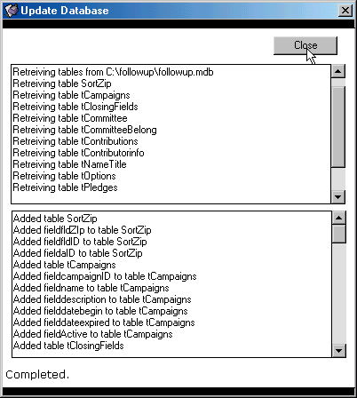



## Access \.mdb update

### Description

This utility allows you to easily update the structure of one .mdb file from another. It analyzes the source and creates the changes to the destination.

It is a good tool for quick updates to multiple files.

Please keep in mind that this was kinda 'thrown' together to serve my own purposes and is by no means a finished work.. it has helped me and I thought it might help someone else... :-)
 
### More Info
 
Access Database Files

             |
---                |---
**Submitted On**   |2002-03-12 22:37:22
**By**             |[J Burgess](https://github.com/Planet-Source-Code/PSCIndex/blob/master/ByAuthor/j-burgess.md)
**Level**          |Intermediate
**User Rating**    |4.9 (69 globes from 14 users)
**Compatibility**  |VB 6\.0
**Category**       |[Databases/ Data Access/ DAO/ ADO](https://github.com/Planet-Source-Code/PSCIndex/blob/master/ByCategory/databases-data-access-dao-ado__1-6.md)
**World**          |[Visual Basic](https://github.com/Planet-Source-Code/PSCIndex/blob/master/ByWorld/visual-basic.md)
**Archive File**   |[MDB\_Update617153122002\.zip](https://github.com/Planet-Source-Code/j-burgess-access-mdb-update__1-32635/archive/master.zip)

